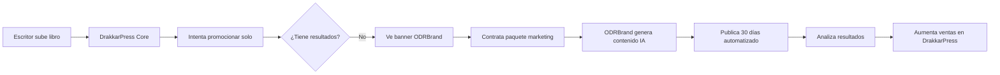
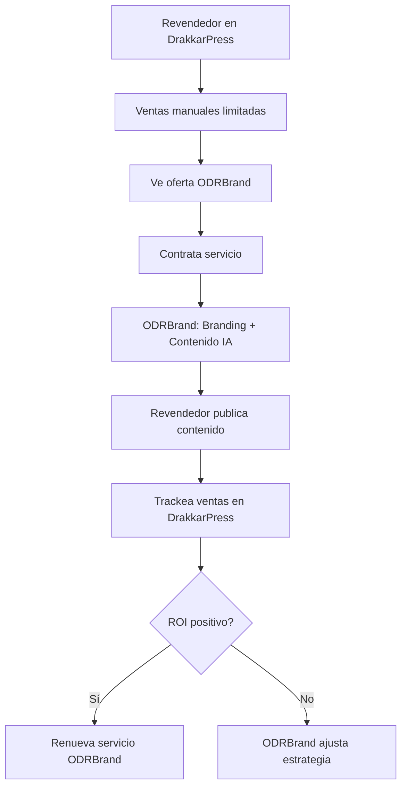
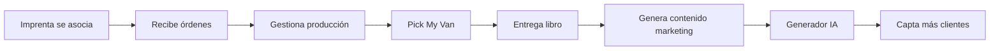

# 🏗️ ARQUITECTURA DEL ECOSISTEMA DRAKKARPRESS
## Plataformas Integradas en el Mismo Dominio

---

## 📊 VISIÓN GENERAL

**DrakkarPress** es una plataforma de autopublicación que trabaja con **partners estratégicos** y desarrolla **herramientas complementarias**, ofreciendo un ecosistema completo:

### Plataformas Principales
- ✍️ **DrakkarPress.com** - Autopublicación de libros (POD + Digital)
- 🎨 **ODRBrand.com** - Agencia de marketing digital (INDEPENDIENTE)

### Herramientas Complementarias (en desarrollo)
- 🚐 **Pick My Van** - Gestión de proyectos
- 📚 **Lector de Libros** - eReader integrado en DrakkarPress
- 📊 **Desarrollador de Informes** - Business Intelligence

### Herramientas Exclusivas de Partners
- 🤖 **Generador de Contenido IA** - Exclusivo de ODRBrand (NO integrado en DrakkarPress)

---

## 🎯 PLATAFORMAS PRINCIPALES (MISMO DOMINIO)

### 1️⃣ **DRAKKARPRESS.COM** (Core Platform)
**Dominio:** `drakkarpress.com`

#### Funcionalidades Principales:
- 📚 Autopublicación de libros (POD + Digital)
- 🛒 Tienda online integrada
- 💰 Sistema de comisiones para revendedores
- 🖨️ Red de imprentas asociadas
- 👥 Roles: Escritores, Revendedores, Imprentas, Lectores

#### Tecnología:
- **Frontend:** HTML5, CSS3, JavaScript (Vanilla)
- **Backend:** Java Spring Boot + PostgreSQL
- **Hosting:** Netlify (Frontend) + Heroku/Railway (Backend)
- **APIs:** Stripe, SendGrid, Cloudinary

#### Rutas Principales:
```
/                      → Home
/catalogo              → Catálogo de libros
/escritores            → Panel escritores
/revendedores          → Panel revendedores
/imprentas             → Panel imprentas
/biblioteca            → Librería personal (Lector integrado)
/servicios-marketing   → Enlace a ODRBrand (externo)
/servicios-research    → Servicios de investigación
/servicios-web         → Desarrollo web
```

---

## 🌐 PLATAFORMAS COMPLEMENTARIAS (DESARROLLOS PARALELOS)

### 2️⃣ **ODRBRAND** (Marketing & Branding Agency)
**Dominio:** `odrbrand.com` (plataforma independiente)  
**Relación con DrakkarPress:** Partner estratégico (enlace desde `/servicios-marketing`)

#### Servicios:
- 🎨 **Branding Completo:** Logo, identidad visual, guías de marca
- 📱 **Marketing Digital:** SEO, SEM, Social Media Management
- 📊 **Análisis de Mercado:** Audiencia, competencia, insights
- 🚀 **Growth Hacking:** Estrategias de crecimiento para creadores
- 💼 **Consultoría Estratégica:** Business model, monetización
- 🤖 **GENERADOR DE CONTENIDO IA:** Herramienta exclusiva ODRBrand

#### 🎯 GENERADOR DE PERFILES IA (Herramienta Interna ODRBrand)
**Acceso:** Solo clientes de ODRBrand  
**Ubicación:** `odrbrand.com/tools/content-generator` (área de cliente)

**Funcionalidades:**
- 🤖 Generación de contenido IA para redes sociales
- 📝 Perfiles personalizados (arquetipos predefinidos + custom)
- � Calendarios de contenido 7-30 días
- 🎨 5+ arquetipos: Fitness, Lifestyle, Gamer, Coach, OnlyFans
- 🔞 Modo adulto profesional (OnlyFans, contenido +18)
- 📊 Analytics de performance
- 🎯 Optimización para conversión

**Casos de Uso:**
1. **Cliente contrata servicio de marketing** → Acceso al generador incluido
2. **Paquete "Social Media Management"** → Genera contenido 30 días
3. **Creadores de contenido** (OnlyFans, YouTube) → Herramienta standalone
4. **Escritores DrakkarPress** → Contratan ODRBrand para promoción profesional

#### Clientes Objetivo:
- ✅ Escritores de DrakkarPress que quieren profesionalizar su marca
- ✅ Revendedores que necesitan presencia digital
- ✅ Imprentas que quieren captar más clientes
- ✅ Creadores de contenido (OnlyFans, YouTube, TikTok)
- ✅ Influencers, coaches, consultores
- ✅ Pequeñas empresas locales

#### Tecnología (Propuesta):
- **Frontend:** React/Next.js
- **Backend:** Node.js + Express/Nest.js
- **Generador IA:** Python (FastAPI) - arquitectura microservicios
- **CRM:** HubSpot/Salesforce API
- **Pagos:** Stripe Connect
- **Hosting:** Vercel (frontend) + Railway (backend + IA)

---

### 4️⃣ **PICK MY VAN** (Project Management Tool)
**Dominio futuro:** `pickmyvan.com`  
**Integración:** Widget embebido en DrakkarPress

#### Funcionalidad:
- 🚐 Gestión de proyectos con metodología Kanban/Scrum
- 📋 Seguimiento de tareas para equipos editoriales
- 📊 Reportes de progreso en tiempo real
- 👥 Colaboración asíncrona

#### Casos de Uso en DrakkarPress:
- **Escritores:** Gestionar proceso de escritura (capítulos, revisiones)
- **Revendedores:** Seguimiento de ventas y campañas
- **Imprentas:** Control de órdenes de impresión (POD)
- **Equipo DrakkarPress:** Gestión interna de desarrollo

---

### 5️⃣ **LECTOR DE LIBROS DIGITAL** (eReader Module)
**Ruta:** `drakkarpress.com/biblioteca`

#### Funcionalidades:
- 📖 Lector web progresivo (PWA)
- 🌙 Modo oscuro, ajuste de fuente, marcadores
- 📝 Notas y highlights sincronizados
- 🔊 Text-to-Speech integrado
- 📊 Estadísticas de lectura

#### Integración:
```javascript
// Compra en DrakkarPress → Acceso inmediato en Biblioteca
usuario.comprar_libro("el-ultimo-drakkar") 
→ biblioteca.agregar_libro(libro_id, formato: "digital")
→ lector.abrir_libro(libro_id)
```

---

### 6️⃣ **DESARROLLADOR DE INFORMES** (Business Intelligence)
**Ruta:** `drakkarpress.com/analytics` (restringido a admin/revendedores)

#### Funcionalidades:
- 📊 Dashboard de ventas en tiempo real
- 📈 Análisis de conversión por canal
- 💰 Reportes de comisiones para revendedores
- 🎯 Métricas de engagement de contenido IA
- 📉 Forecasting de ventas con ML

#### Datos Integrados:
- Ventas de libros (físicos + digitales)
- Performance de contenido IA generado
- ROI de campañas de ODRBrand
- Productividad de proyectos (Pick My Van)
- Hábitos de lectura (Lector Digital)

---

## 🔗 FLUJOS DE INTEGRACIÓN

### FLUJO 1: Escritor Autopublicado → Cliente ODRBrand


### FLUJO 2: Revendedor que Escala con ODRBrand


### FLUJO 3: Imprenta POD Profesional


---

## 🛠️ STACK TECNOLÓGICO (SEPARADO)

### DrakkarPress Database (PostgreSQL)
```sql
-- Esquema DrakkarPress (independiente)
users (id, email, role, created_at)
books (id, author_id, title, genre, price)
orders (id, user_id, book_id, status, commission)
odrbrand_referrals (id, user_id, referral_code, converted)
analytics (id, entity_id, metric, value, timestamp)
projects (id, owner_id, name, status, tasks)  -- Pick My Van
```

### ODRBrand Database (PostgreSQL - Separada)
```sql
-- Esquema ODRBrand (independiente)
clients (id, email, source, drakkarpress_user_id)
ai_generated_content (id, client_id, platform, content)
services (id, client_id, service_type, price)
```

### APIs (Independientes)
```javascript
// DrakkarPress API
https://api.drakkarpress.com/v1/
  /auth          → Autenticación
  /books         → Catálogo
  /orders        → Ventas
  /referrals     → Tracking de referidos a ODRBrand
  /projects      → Pick My Van
  /reader        → Lector digital

// ODRBrand API (Separada)
https://api.odrbrand.com/v1/
  /auth          → Autenticación propia
  /clients       → Gestión de clientes
  /generators    → Generador IA (privado)
  /services      → Servicios contratados
```

### Comunicación Entre Plataformas
```javascript
// NO hay SSO ni API compartida
// Relación vía referral tracking

// Usuario en DrakkarPress hace click
https://odrbrand.com?ref=drakkarpress&user_id=123

// ODRBrand registra origen y notifica conversión
POST https://api.drakkarpress.com/v1/referrals/conversion
{
  "referral_code": "drakkarpress_123",
  "client_email": "usuario@example.com",
  "service_purchased": "paquete_basico",
  "commission_due": 75.00
}
```

---

## 📈 ESTRATEGIA DE MONETIZACIÓN

### Modelo de Negocio

#### DrakkarPress (Plataforma Freemium)
| Plan | Precio | Incluye |
|------|--------|---------|
| **Gratuito** | $0 | 1 libro/año, lector básico |
| **Premium** | $9.99/mes | Libros ilimitados, analytics, Pick My Van |
| **Enterprise** | Custom | API access, whitelabel |

#### ODRBrand (Servicios Profesionales)
| Servicio | Precio | Incluye |
|----------|--------|---------|
| **Consulta** | Gratis | Diagnóstico y propuesta |
| **Paquete Básico** | $500 único | Branding + 30 días contenido IA |
| **Profesional** | $299/mes | Todo Básico + contenido ilimitado |
| **Enterprise** | $999/mes | Gestión completa + ads |

#### Comisiones por Referido (DrakkarPress → ODRBrand)
```javascript
// DrakkarPress gana comisión por cada cliente referido
{
  "paquete_basico": "$75 (15%)",
  "profesional_mes_1": "$45 (15%)",
  "enterprise_mes_1": "$150 (15%)",
  "renovaciones": "10% perpetuas"
}
```

---

## 🚀 ROADMAP DE DESARROLLO

### FASE 1: CORE ✅ (Completado)
- [x] DrakkarPress plataforma básica
- [x] Catálogo y sistema de pagos
- [x] Roles: Escritor, Revendedor, Imprenta

### FASE 2: PARTNERSHIP ODRBRAND 🔄 (En Progreso)
- [x] ODRBrand desarrolla Generador IA (independiente)
- [ ] DrakkarPress crea página `/servicios-marketing.html`
- [ ] Sistema de tracking de referidos (cookies + webhooks)
- [ ] Landing page ODRBrand para usuarios DrakkarPress
- [ ] Acuerdo legal de partnership

### FASE 3: COMPLEMENTOS DRAKKARPRESS 📋 (Siguiente)
- [ ] Pick My Van MVP (integrado en DrakkarPress)
- [ ] Lector Digital mejorado (PWA)
- [ ] Analytics dashboard v1
- [ ] API pública para developers

### FASE 4: INTELIGENCIA 🤖 (Futuro)
- [ ] ML para recomendaciones de libros
- [ ] Optimización automática de contenido IA
- [ ] Predicción de ventas
- [ ] Chatbot de soporte unificado

### FASE 5: ESCALABILIDAD 🌍 (Visión)
- [ ] Multi-idioma (inglés, portugués, francés)
- [ ] Multi-moneda y multi-país
- [ ] Marketplace de servicios (escritores freelance, diseñadores)
- [ ] Programa de afiliados cross-platform

---

## 🎯 CASOS DE USO REALES

### CASO 1: María - Escritora Novata
**Problema:** No sabe promocionar su libro.

**Solución Ecosistema:**
1. Publica en **DrakkarPress** → ISBN + POD automático
2. Intenta promocionar por su cuenta → Resultados limitados
3. Ve banner **"¿Necesitas ayuda con marketing?"** → Enlace a ODRBrand
4. Contrata **ODRBrand** paquete básico ($500) → Incluye:
   - Logo y branding de autora
   - 30 días de contenido IA (Generador exclusivo ODRBrand)
   - Programación automática en redes
5. Gestiona escritura siguiente libro con **Pick My Van**
6. Analiza ventas en **DrakkarPress Analytics**

**Resultado:** Vende 500 copias en 3 meses vs 20 sin ODRBrand.

---

### CASO 2: Pedro - Revendedor Ambicioso
**Problema:** Competencia fuerte, ventas estancadas.

**Solución Ecosistema:**
1. Selecciona nicho en **DrakkarPress** → Fantasía épica
2. Promoción manual → Bajo engagement
3. Contrata **ODRBrand** servicio mensual ($299/mes) → Incluye:
   - Análisis de competencia y audiencia
   - Branding personalizado
   - Contenido IA ilimitado (Generador ODRBrand)
   - Gestión parcial de redes sociales
4. Trackea conversión en **DrakkarPress Analytics**
5. Escala con campañas de pago (Meta Ads gestionadas por ODRBrand)

**Resultado:** $5,000/mes en comisiones vs $500 antes.

---

### CASO 3: Imprenta Local → Nacional
**Problema:** Solo trabaja offline, capacidad ociosa.

**Solución Ecosistema:**
1. Se asocia a **DrakkarPress** → Órdenes POD nacionales
2. Gestiona producción con **Pick My Van** → Kanban de órdenes
3. Marketing con **Generador IA** → LinkedIn + Google My Business
4. Consultoría **ODRBrand** → Rebranding moderno

**Resultado:** 300% aumento en órdenes, se expande a 3 ciudades.

---

## 🔐 SEGURIDAD Y PRIVACIDAD

### Datos Compartidos Entre Plataformas
```javascript
// Qué se comparte (con consentimiento):
- Email y perfil básico
- Historial de compras
- Preferencias de contenido
- Métricas agregadas

// Qué NO se comparte:
- Contraseñas (hash bcrypt independiente)
- Datos de pago (tokenizados por Stripe)
- Contenido privado (drafts de libros)
- Mensajes internos
```

### GDPR y Compliance
- ✅ Consentimiento explícito para compartir datos
- ✅ Derecho al olvido (eliminación en cascada)
- ✅ Exportación de datos en JSON
- ✅ Opt-out de analytics en cualquier momento

---

## 📞 CONTACTO Y SOPORTE

### Soporte Unificado
- **Email:** soporte@drakkarpress.com
- **Chat:** Widget común en todas las plataformas
- **FAQ:** Base de conocimiento compartida
- **Status Page:** status.drakkarpress.com

### Comunidad
- **Discord:** Escritores, revendedores, imprentas
- **Blog:** Tutoriales y casos de éxito
- **Newsletter:** Novedades del ecosistema

---

## 📄 LICENCIAS Y TÉRMINOS

- **DrakkarPress Core:** Propietario
- **Generador IA:** MIT (código abierto)
- **APIs:** Uso gratuito hasta 10k requests/mes
- **ODRBrand:** Propietario (servicios profesionales)
- **Pick My Van:** Freemium
- **Lector Digital:** Incluido en DrakkarPress
- **Analytics:** Freemium

---

## 🎉 CONCLUSIÓN

**DrakkarPress** no es solo una plataforma de autopublicación.  
Es un **ecosistema completo** que acompaña al escritor/emprendedor desde:

1. 📝 **Creación** (escribir el libro)
2. 🚀 **Publicación** (DrakkarPress Core)
3. 📣 **Promoción** (Generador IA + ODRBrand)
4. 📊 **Análisis** (Analytics)
5. 🔄 **Optimización** (Pick My Van + feedback loop)

Todo trabajando en **simultaneo**, con **datos compartidos** y **autenticación unificada**.

---

<div align="center">

**🚀 Construyendo el futuro de la autopublicación digital 🚀**

[📚 DrakkarPress](https://drakkarpress.com) | [🤖 Generador IA](/generators) | [🎨 ODRBrand](/servicios-marketing)

---

**Versión 1.0** | Última actualización: Noviembre 2025  
© 2025 DrakkarPress - Todos los derechos reservados

</div>
