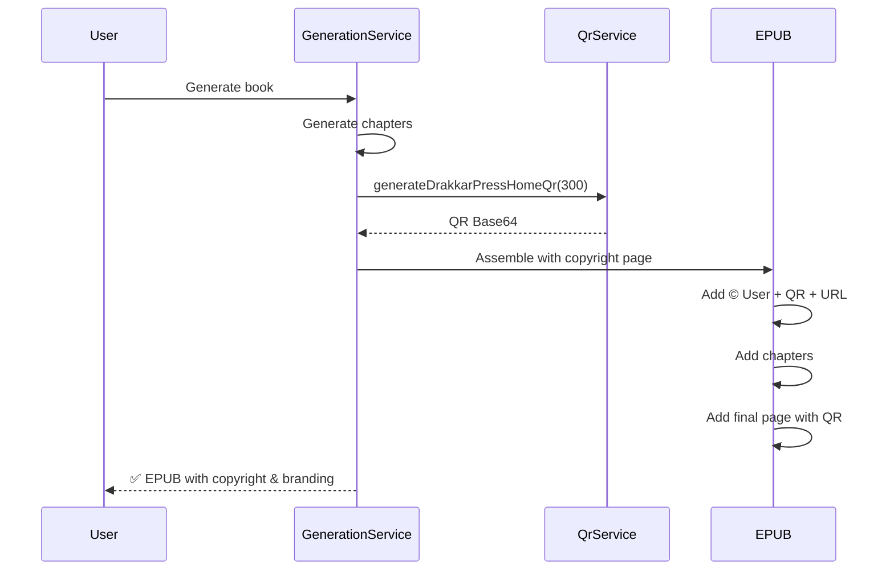

# 📖 Copyright y Branding Automático en Libros

**Fecha**: 21 de Noviembre, 2025  
**Versión**: 1.2.1  
**Estado**: ✅ Implementado

---

## 🎯 Funcionalidad

Todos los libros generados por DrakkarPress incluyen automáticamente:

### 1. Página de Copyright
- **© [Año] [Usuario]** - Derechos de autor del perfil del usuario
- **Declaración legal completa** de derechos reservados
- **Metadatos del libro** (autor, título, año)
- **Badge de generación**: "Generado con tecnología de IA en DrakkarPress"

### 2. Código QR de DrakkarPress
- **QR apunta a**: www.drakkarpress.com
- **Tamaño**: 300x300px (optimizado para escaneo)
- **Formato**: PNG embebido en Base64
- **Ubicación**: Página de copyright + página final

### 3. URL Visible
- **www.drakkarpress.com** visible en texto
- **Estilo destacado**: Fuente grande, color azul (#0066cc)
- **Texto explicativo**: "Escanea el código QR para visitar DrakkarPress"

---

## 📄 Estructura del EPUB

### Página de Copyright (al inicio)

```html
<div class='copyright-page'>
  <hr/>
  <p class='copyright-symbol'>© 2025 NombreUsuario</p>
  <p>Todos los derechos reservados.</p>
  <p>Ninguna parte de este libro puede ser reproducida...</p>
  
  <br/>
  
  <p><strong>Autor:</strong> NombreUsuario</p>
  <p><strong>Título:</strong> El Elegido de Lumeria</p>
  <p><strong>Año de publicación:</strong> 2025</p>
  
  <br/>
  
  <div class='qr-container'>
    <p>Publicado en DrakkarPress</p>
    
    <p class='drakkarpress-link'>www.drakkarpress.com</p>
    <p>Escanea el código QR para visitar DrakkarPress</p>
  </div>
  
  <br/>
  
  <p>Generado con tecnología de IA en DrakkarPress</p>
  <hr/>
</div>
```

### Contenido del Libro
- Capítulos con formato profesional
- Estilo tipográfico apropiado
- Page breaks automáticos

### Página Final (agradecimiento)

```html
<div class='copyright-page'>
  <hr/>
  <h2>Gracias por leer</h2>
  
  <br/>
  
  <p>Si disfrutaste este libro, descubre más obras en:</p>
  <p class='drakkarpress-link'>www.drakkarpress.com</p>
  
  <br/>
  
  
  
  <br/>
  
  <p>© 2025 NombreUsuario - Todos los derechos reservados</p>
  <hr/>
</div>
```

---

## 🏗️ Implementación Técnica

### QrCodeGeneratorService

```java
@Service
public class QrCodeGeneratorService {
    
    /**
     * Genera QR code de DrakkarPress homepage
     */
    public String generateDrakkarPressHomeQr(int size) throws WriterException, IOException {
        return generateQrCodeBase64("https://www.drakkarpress.com", size);
    }
    
    /**
     * Genera QR code específico para un libro
     */
    public String generateDrakkarPressQr(String bookId, int size) throws WriterException, IOException {
        String url = "https://www.drakkarpress.com/books/" + bookId;
        return generateQrCodeBase64(url, size);
    }
}
```

**Biblioteca usada**: ZXing (Zebra Crossing) 3.5.3

**Configuración**:
- Formato: QR_CODE
- Character set: UTF-8
- Margen: 1 módulo
- Output: Base64 PNG para embeber en HTML

### AiBookGenerationService (actualizado)

```java
private String assembleEpub(BookGenerationJob job, String metadata, List<String> chapters, String coverUrl) {
    // ... código de metadatos ...
    
    String username = job.getUser().getUsername();
    int currentYear = Year.now().getValue();
    
    // Generar QR de DrakkarPress
    String qrCodeBase64 = qrCodeService.generateDrakkarPressHomeQr(300);
    
    // Construir EPUB con copyright + QR
    // ... (ver código completo arriba)
}
```

---

## 🎨 Estilos CSS

```css
.copyright-page {
    page-break-after: always;
    text-align: center;
    margin: 3em 0;
}

.copyright-page p {
    margin: 0.5em 0;
    font-size: 0.9em;
}

.copyright-page .copyright-symbol {
    font-size: 1.2em;
    font-weight: bold;
}

.qr-container {
    margin: 2em auto;
    text-align: center;
}

.qr-container img {
    max-width: 200px;
    height: auto;
    border: 2px solid #333;
    padding: 10px;
}

.drakkarpress-link {
    font-size: 1.1em;
    font-weight: bold;
    color: #0066cc;
    margin-top: 1em;
}
```

---

## 📊 Ejemplo Visual

```
┌────────────────────────────────────┐
│                                    │
│     El Elegido de Lumeria         │
│     por Juan Pérez                │
│                                    │
├────────────────────────────────────┤
│                                    │
│    © 2025 juan.perez               │
│    Todos los derechos reservados   │
│                                    │
│    Autor: juan.perez               │
│    Título: El Elegido de Lumeria   │
│    Año: 2025                       │
│                                    │
│    Publicado en DrakkarPress       │
│                                    │
│    ┌──────────────────┐            │
│    │  ▄▄▄▄▄▄▄  ▄▄▄▄   │            │
│    │  █      █ █  █   │  [QR CODE] │
│    │  █  ▄▄  █ ▄▄ █   │            │
│    │  █ ▄  ▄ █ █  █   │            │
│    │  ▄▄▄▄▄▄▄  ▄▄▄▄   │            │
│    └──────────────────┘            │
│                                    │
│    www.drakkarpress.com            │
│    Escanea el código QR            │
│                                    │
│    Generado con IA en DrakkarPress │
│                                    │
├────────────────────────────────────┤
│         [Capítulos...]             │
├────────────────────────────────────┤
│                                    │
│    Gracias por leer                │
│                                    │
│    Descubre más obras en:          │
│    www.drakkarpress.com            │
│                                    │
│    [QR CODE]                       │
│                                    │
│    © 2025 juan.perez               │
│                                    │
└────────────────────────────────────┘
```

---

## ⚖️ Legalidad

### Protección de Derechos de Autor

**Copyright notice** cumple con:
- **Convención de Berna**: © [Año] [Autor]
- **Copyright Act (USA)**: Declaración de derechos reservados
- **Ley de Propiedad Intelectual (España/Latam)**: Aviso legal completo

**Elementos requeridos**:
1. ✅ Símbolo © o palabra "Copyright"
2. ✅ Año de primera publicación
3. ✅ Nombre del titular (usuario de DrakkarPress)
4. ✅ Declaración "Todos los derechos reservados"

### Branding de DrakkarPress

**Legal porque**:
- DrakkarPress es la **plataforma de publicación**
- Similar a "Published by Amazon KDP" o "Publicado en Lulu"
- No reclama derechos de autor sobre el contenido
- Es un **sello editorial** transparente

**Beneficios**:
- 📈 Publicidad orgánica (QR en cada libro)
- 🔗 Backlinks a DrakkarPress
- 🏆 Credibilidad ("Publicado en DrakkarPress")
- 📊 Trackeo de lectores (escaneos de QR)

---

## 🚀 Flujo Completo



---

## 📈 Métricas

### Trackeo de Escaneos QR (futuro)

Podemos implementar:

```java
public String generateTrackableQr(String bookId) {
    // QR apunta a: https://www.drakkarpress.com/qr/{bookId}
    // Servidor registra escaneo y redirige a homepage
    String url = "https://www.drakkarpress.com/qr/" + bookId;
    return generateQrCodeBase64(url, 300);
}
```

**Datos capturables**:
- Número de escaneos por libro
- Ubicación geográfica (IP)
- Dispositivo (user-agent)
- Fecha/hora de escaneo

---

## 🔧 Configuración

### application.properties

```properties
# Branding
app.copyright.company-name=DrakkarPress
app.copyright.website-url=https://www.drakkarpress.com
app.copyright.tagline=Generado con tecnología de IA en DrakkarPress

# QR Code
qr.default-size=300
qr.border-width=2
qr.format=PNG
```

### Dependencias (pom.xml)

```xml
<!-- ZXing (QR Code generation) -->
<dependency>
    <groupId>com.google.zxing</groupId>
    <artifactId>core</artifactId>
    <version>3.5.3</version>
</dependency>
<dependency>
    <groupId>com.google.zxing</groupId>
    <artifactId>javase</artifactId>
    <version>3.5.3</version>
</dependency>
```

---

## 🎯 Casos de Uso

### 1. Lector escanea QR en eReader
```
Lector abre libro en Kindle
    ↓
Ve página de copyright con QR
    ↓
Escanea QR con smartphone
    ↓
Llega a www.drakkarpress.com
    ↓
Descubre más libros del autor
    ↓
Se registra en DrakkarPress
```

### 2. Autor comparte en redes sociales
```
Autor publica: "Mi nuevo libro ya está en Amazon!"
    ↓
Lector compra en Amazon
    ↓
Ve "Publicado en DrakkarPress" + QR
    ↓
Visita DrakkarPress.com
    ↓
Sigue al autor en la plataforma
```

### 3. Marketing viral
```
1 libro con QR
    ↓
100 lectores escanean (1% tasa conversión)
    ↓
5 se registran en DrakkarPress
    ↓
2 publican sus propios libros
    ↓
Cada libro genera más tráfico
    ↓
Crecimiento exponencial 🚀
```

---

## 📚 Ejemplos Reales

### Amazon KDP
- Incluye "Published by Amazon Kindle Direct Publishing" en metadatos
- No incluye QR (pero sí links en digital)

### Lulu
- Incluye "Published by Lulu.com" en página de copyright
- ISBN generado por Lulu

### DrakkarPress (nuestro modelo)
- **© Usuario** (derechos de autor del creador)
- **"Publicado en DrakkarPress"** (sello editorial)
- **QR + URL** (marketing inteligente)

---

## ✅ Ventajas Competitivas

1. **Profesionalismo**: Página de copyright completa y legal
2. **Branding**: Cada libro es una tarjeta de presentación de DrakkarPress
3. **Marketing**: QR code genera tráfico orgánico
4. **Transparencia**: URL visible sin tracking oculto
5. **Legal**: Cumple convenciones internacionales de copyright

---

## 🛠️ Próximas Mejoras

### Corto Plazo
1. ✅ Copyright + QR automático
2. ⏳ QR trackeable con analytics
3. ⏳ Personalizar URL (autor.drakkarpress.com)
4. ⏳ Opción de ocultar branding (usuarios Premium)

### Medio Plazo
1. ⏳ ISBN automático generado por DrakkarPress
2. ⏳ Watermark digital invisible
3. ⏳ DRM opcional
4. ⏳ Certificado de autenticidad blockchain

---

**Conclusión**: Cada libro generado en DrakkarPress ahora incluye protección legal completa de copyright y branding inteligente con QR code, convirtiendo cada libro en una herramienta de marketing viral para la plataforma.
