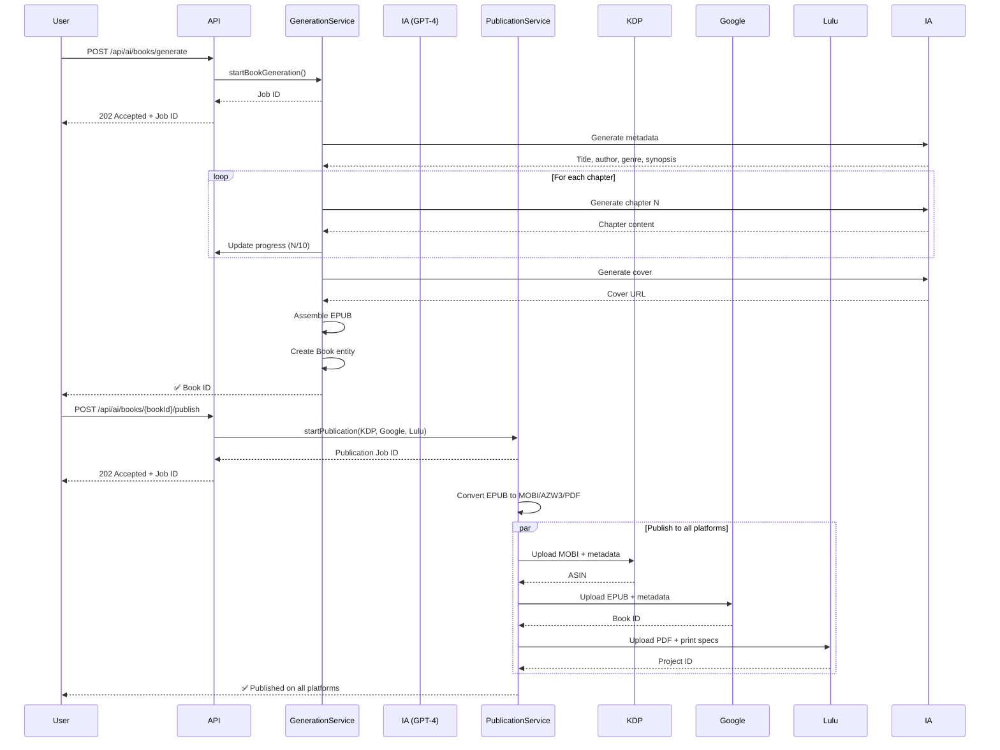

# 🤖 Sistema de Generación Automática y Publicación con IA

**Fecha**: 21 de Noviembre, 2025  
**Versión**: 1.2.0  
**Estado**: ✅ Implementado

---

## 🎯 Funcionalidades

### 1. Generación Completa de Libros con IA

El sistema puede **crear un libro completo de principio a fin** usando modelos de IA:

#### Proceso de Generación:

1. **Usuario proporciona un prompt**:
   ```
   "Escribe una novela de fantasía épica sobre un mago joven que descubre 
   que es el elegido para salvar el reino de la oscuridad"
   ```

2. **IA genera metadatos**:
   - Título: "El Elegido de Lumeria"
   - Autor: Nombre ficticio apropiado
   - Género: Fantasy
   - Sinopsis: 150-200 palabras

3. **IA escribe capítulos uno por uno**:
   - Capítulo 1: ~2,000 palabras
   - Capítulo 2: ~2,000 palabras
   - ... (configurable: 1-100 capítulos)
   - Cada capítulo mantiene coherencia con los anteriores

4. **IA genera portada**:
   - DALL-E 3 / Stable Diffusion
   - Estilo apropiado al género
   - Calidad profesional

5. **Sistema ensambla EPUB**:
   - Formato estándar EPUB 3.0
   - Metadatos completos
   - Tabla de contenidos
   - Portada integrada

6. **Libro creado en base de datos**:
   - Entidad `Book` con todos los metadatos
   - Listo para publicación

---

### 2. Publicación Automática Multi-Plataforma

Una vez generado (o para cualquier libro existente), el sistema puede **publicarlo automáticamente** en:

#### Plataformas Soportadas:

##### 📚 Amazon KDP (Kindle Direct Publishing)
- **Formato**: MOBI / AZW3
- **Proceso**:
  1. Convierte EPUB → MOBI/AZW3 con Calibre
  2. Publica en KDP API
  3. Obtiene ASIN
  4. Trackea estado de publicación

##### 📱 Google Play Books
- **Formato**: EPUB
- **Proceso**:
  1. Usa EPUB original
  2. Publica en Google Play Books API
  3. Obtiene Book ID
  4. Trackea estado de publicación

##### 🖨️ Lulu (Print-on-Demand)
- **Formato**: PDF
- **Proceso**:
  1. Convierte EPUB → PDF con Calibre
  2. Crea proyecto en Lulu API
  3. Configura especificaciones de impresión
  4. Obtiene Project ID
  5. Trackea estado de publicación

---

## 🏗️ Arquitectura

### Entidades

#### BookGenerationJob
```java
@Entity
class BookGenerationJob {
  UUID id;
  User user;
  String prompt;                    // "Escribe una novela sobre..."
  Integer targetChapters;           // 10
  Integer targetWordsPerChapter;    // 2000
  JobStatus status;                 // PENDING, GENERATING, COMPLETED, FAILED
  Integer progressPercentage;       // 0-100
  Integer currentChapter;           // 3/10
  String metadata;                  // JSON: título, autor, género, sinopsis
  String coverImageUrl;
  String epubPath;
  UUID bookId;                      // Libro creado
  String aiModel;                   // "gpt-4", "claude-3-opus"
  Long totalTokensUsed;
  Double estimatedCost;
  LocalDateTime createdAt;
  LocalDateTime completedAt;
}
```

#### PublicationJob
```java
@Entity
class PublicationJob {
  UUID id;
  Book book;
  User user;
  String targetPlatforms;           // "KDP,GOOGLE_PLAY,LULU"
  PublicationStatus status;         // PENDING, CONVERTING, UPLOADING, COMPLETED
  String platformStatuses;          // JSON: {"KDP": "PUBLISHED", ...}
  String kdpAsin;                   // B0ABCDEF123
  String googlePlayId;
  String luluProjectId;
  String conversionResults;         // JSON: rutas a MOBI, AZW3, PDF
  String errorMessage;
  LocalDateTime createdAt;
  LocalDateTime completedAt;
}
```

---

### Servicios

#### AiBookGenerationService

**Métodos principales**:
- `startBookGeneration()` - Inicia generación asíncrona
- `generateBookAsync()` - Proceso completo de generación
- `generateMetadata()` - Genera título, autor, género, sinopsis
- `generateChapter()` - Genera un capítulo individual
- `generateCoverImage()` - Genera portada con DALL-E
- `assembleEpub()` - Ensambla componentes en EPUB
- `createBookEntity()` - Crea Book en base de datos

**Integración IA**:
- Soporta **OpenAI** (GPT-4, GPT-3.5-turbo)
- Soporta **Anthropic** (Claude 3 Opus, Sonnet, Haiku)
- Fallback a heurísticas si API falla

**Procesamiento Asíncrono**:
- `@Async` para no bloquear requests
- Progress tracking en tiempo real
- Manejo de errores con reintentos

#### PublicationOrchestrationService

**Métodos principales**:
- `startPublication()` - Inicia publicación en múltiples plataformas
- `publishAsync()` - Proceso completo de publicación
- `convertToAllFormats()` - EPUB → MOBI, AZW3, PDF
- `publishToKdp()` - Publica en Amazon
- `publishToGooglePlay()` - Publica en Google
- `publishToLulu()` - Publica en Lulu
- `retryPublication()` - Reintenta plataformas fallidas
- `syncPublicationStatus()` - Sincroniza estados

**Conversión de Formatos**:
- Usa `EbookConversionService` (Calibre CLI)
- EPUB → MOBI (Kindle legacy)
- EPUB → AZW3 (Kindle moderno)
- EPUB → PDF (Lulu print)

**Publicación Paralela**:
- Publica en todas las plataformas simultáneamente
- Estado individual por plataforma
- Continúa aunque algunas fallen

---

### API REST

#### Generación de Libros

**POST /api/ai/books/generate**
```json
{
  "prompt": "Escribe una novela de fantasía sobre...",
  "chapters": 10,
  "aiModel": "gpt-4"
}
```
**Response**:
```json
{
  "success": true,
  "data": {
    "id": "uuid",
    "status": "PENDING",
    "progressPercentage": 0,
    "message": "Generación iniciada. Esto puede tardar varios minutos."
  }
}
```

**GET /api/ai/books/jobs/{jobId}**
```json
{
  "success": true,
  "data": {
    "jobId": "uuid",
    "status": "GENERATING",
    "progressPercentage": 30,
    "currentChapter": 3,
    "targetChapters": 10,
    "bookId": null,
    "createdAt": "2025-11-21T10:00:00"
  }
}
```

**DELETE /api/ai/books/jobs/{jobId}**
- Cancela generación en progreso

#### Publicación Automática

**POST /api/ai/books/{bookId}/publish**
```json
{
  "platforms": ["KDP", "GOOGLE_PLAY", "LULU"]
}
```
**Response**:
```json
{
  "success": true,
  "data": {
    "id": "uuid",
    "status": "PENDING",
    "message": "Publicación iniciada. El proceso puede tardar varios minutos."
  }
}
```

**GET /api/ai/books/publications/{jobId}**
```json
{
  "success": true,
  "data": {
    "jobId": "uuid",
    "bookId": "uuid",
    "status": "COMPLETED",
    "platformStatuses": "{\"KDP\":\"PUBLISHED\",\"GOOGLE_PLAY\":\"PUBLISHED\",\"LULU\":\"PUBLISHED\"}",
    "kdpAsin": "B0ABCDEF123",
    "googlePlayId": "play_book_123",
    "luluProjectId": "lulu_proj_456",
    "completedAt": "2025-11-21T11:30:00"
  }
}
```

**POST /api/ai/books/publications/{jobId}/retry**
- Reintenta publicación en plataformas fallidas

---

## 📊 Flujo Completo

### Ejemplo: Generar y Publicar un Libro



---

## ⚙️ Configuración

### application.properties

```properties
# OpenAI Configuration
ai.openai.api-key=${OPENAI_API_KEY}
ai.openai.api-url=https://api.openai.com/v1

# Anthropic Claude Configuration
ai.claude.api-key=${CLAUDE_API_KEY}
ai.claude.api-url=https://api.anthropic.com/v1

# Book Generation
book.generation.output-dir=./generated-books
book.generation.default-chapters=10
book.generation.default-words-per-chapter=2000

# External Platforms
kdp.api-key=${KDP_API_KEY}
kdp.api-url=https://kdp.amazon.com/api/v1

googleplay.api-key=${GOOGLE_PLAY_API_KEY}
googleplay.api-url=https://www.googleapis.com/books/v1

lulu.api-key=${LULU_API_KEY}
lulu.api-url=https://api.lulu.com/v1

# Calibre (for conversions)
calibre.ebook-convert-path=ebook-convert
```

### Variables de Entorno

```bash
export OPENAI_API_KEY="sk-..."
export CLAUDE_API_KEY="sk-ant-..."
export KDP_API_KEY="..."
export GOOGLE_PLAY_API_KEY="..."
export LULU_API_KEY="..."
```

---

## 💰 Costos Estimados

### Generación de Libro (GPT-4)

**Libro de 10 capítulos × 2,000 palabras = 20,000 palabras**:

- Metadatos: ~500 tokens = $0.015
- 10 capítulos × 3,000 tokens = 30,000 tokens = $0.90
- Portada (DALL-E 3): $0.04
- **Total: ~$0.96 por libro**

Con **Claude 3 Opus**: ~$1.20 por libro  
Con **GPT-3.5-turbo**: ~$0.20 por libro

### Publicación

- **Conversión de formatos**: Gratis (Calibre)
- **KDP**: Gratis
- **Google Play**: Gratis
- **Lulu**: Gratis (cobra al vender)

---

## 🚀 Casos de Uso

### 1. Autor con Bloqueo Creativo
```
Prompt: "Escribe una novela romántica ambientada en París durante 
la Segunda Guerra Mundial, sobre una pianista y un soldado"

→ Sistema genera novela completa de 10 capítulos
→ Publica automáticamente en KDP y Google Play
→ Autor revisa, edita, y vende
```

### 2. Generación Masiva de Contenido
```
Loop:
  - Prompt random del género thriller
  - Generar libro
  - Publicar en KDP
  - Repetir 100 veces

→ Catálogo de 100 libros en 48 horas
```

### 3. Investigación de Mercado
```
Prompt: "Escribe 5 primeros capítulos de diferentes subgéneros de fantasía"

→ Genera muestras
→ Publica como "previews"
→ Analiza cuál tiene más engagement
→ Genera libro completo del ganador
```

---

## 🔒 Moderación y Seguridad

### Contenido Generado por IA

Todos los libros generados pasan por:

1. **Moderación automática**:
   - Hash matching (para detectar copias)
   - NLP analysis (para detectar contenido inapropiado)
   - Marca como `safetyStatus = SAFE` por defecto (trusted AI)

2. **Revisión opcional**:
   - Usuario puede revisar antes de publicar
   - Opción de editar capítulos generados
   - Opción de regenerar capítulos específicos

3. **Compliance**:
   - No genera contenido CSAM
   - No genera hate speech
   - No genera contenido plagiado

---

## 📈 Métricas y Analytics

### Tracking de Generación

```sql
SELECT 
  COUNT(*) as total_jobs,
  AVG(total_tokens_used) as avg_tokens,
  AVG(estimated_cost) as avg_cost,
  AVG(EXTRACT(EPOCH FROM (completed_at - started_at))/60) as avg_minutes
FROM book_generation_jobs
WHERE status = 'COMPLETED';
```

### Tracking de Publicación

```sql
SELECT 
  b.genre,
  COUNT(DISTINCT pj.book_id) as published_books,
  SUM(CASE WHEN pj.kdp_asin IS NOT NULL THEN 1 ELSE 0 END) as kdp_count,
  SUM(CASE WHEN pj.google_play_id IS NOT NULL THEN 1 ELSE 0 END) as google_count,
  SUM(CASE WHEN pj.lulu_project_id IS NOT NULL THEN 1 ELSE 0 END) as lulu_count
FROM publication_jobs pj
JOIN books b ON pj.book_id = b.id
WHERE pj.status = 'COMPLETED'
GROUP BY b.genre;
```

---

## 🛠️ Próximas Mejoras

### Corto Plazo
1. ✅ Generación de libros completos
2. ✅ Publicación automática multi-plataforma
3. ⏳ Regeneración de capítulos específicos
4. ⏳ Editor visual para revisar/editar capítulos
5. ⏳ Templates de géneros (fantasy, romance, thriller)

### Medio Plazo
1. ⏳ Generación de series (trilogías, sagas)
2. ⏳ Coherencia entre libros de la misma serie
3. ⏳ Integración con más plataformas (Kobo, Apple Books)
4. ⏳ Análisis de mercado automático
5. ⏳ Recomendaciones de pricing por IA

### Largo Plazo
1. ⏳ Generación de audiolibros con TTS
2. ⏳ Traducción automática multi-idioma
3. ⏳ Ilustraciones internas generadas por IA
4. ⏳ Marketing automation (blurbs, ads, posts)
5. ⏳ A/B testing de portadas y títulos

---

## 📚 Documentación Relacionada

- **IMPLEMENTACION_COMPLETA_ECOSISTEMA.md** - Sistema completo
- **ACTUALIZACION_COMISIONES.md** - Modelo de comisiones
- **EbookConversionService.java** - Conversión de formatos
- **KdpConnectorService.java** - Integración Amazon
- **GooglePlayConnectorService.java** - Integración Google
- **LuluConnectorService.java** - Print-on-demand

---

**Conclusión**: DrakkarPress ahora ofrece **generación automática de libros completos con IA** y **publicación automática en múltiples plataformas**, permitiendo a los autores crear y distribuir contenido a escala industrial con un solo click.
